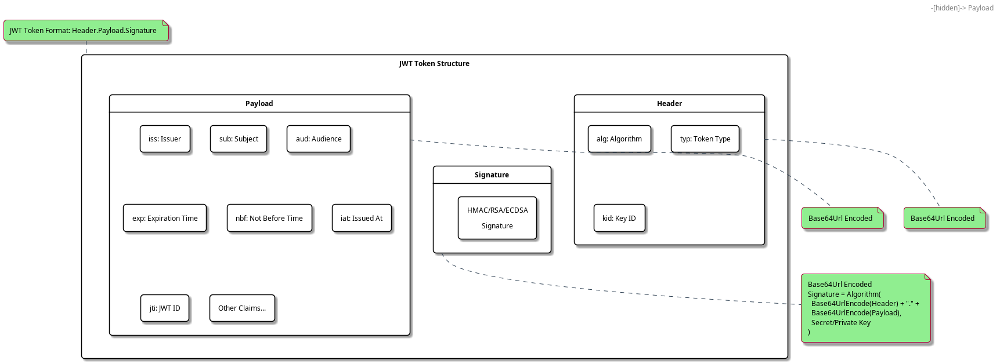

= JWT Token Handling Requirements
:toc:
:toclevels: 3
:toc-title: Table of Contents
:sectnums:

== Overview

This document outlines the functional and non-functional requirements for the JWT Token Validation library.

== Referenced Standards

The following standards and specifications are referenced in this document:

* https://datatracker.ietf.org/doc/html/rfc7519[RFC 7519 - JSON Web Token (JWT)] - May 2015
* https://datatracker.ietf.org/doc/html/rfc7518[RFC 7518 - JSON Web Algorithms (JWA)] - May 2015
* https://datatracker.ietf.org/doc/html/rfc7517[RFC 7517 - JSON Web Key (JWK)] - May 2015
* https://datatracker.ietf.org/doc/html/rfc7516[RFC 7516 - JSON Web Encryption (JWE)] - May 2015
* https://datatracker.ietf.org/doc/html/rfc6749[RFC 6749 - OAuth 2.0 Authorization Framework] - October 2012
* https://openid.net/specs/openid-connect-core-1_0.html[OpenID Connect Core 1.0] - November 2014
* https://datatracker.ietf.org/doc/html/draft-ietf-oauth-jwt-bcp-09[OAuth 2.0 JWT Best Current Practices] - Latest draft, July 2023
* https://nvlpubs.nist.gov/nistpubs/SpecialPublications/NIST.SP.800-131Ar2.pdf[NIST SP 800-131A Revision 2] - March 2019
* https://www.rfc-editor.org/rfc/rfc8017.html[RFC 8017 - PKCS #1: RSA Cryptography Specifications Version 2.2] - November 2016

== Functional Requirements

[#CUI-JWT-1]
=== CUI-JWT-1: Token Parsing and Validation

The library must provide robust token parsing and validation capabilities in accordance with https://datatracker.ietf.org/doc/html/rfc7519[RFC 7519 - JSON Web Token (JWT)] (May 2015).

[#CUI-JWT-1.1]
==== CUI-JWT-1.1: Token Structure

The library must support standard JWT token structure with header, payload, and signature as defined in RFC 7519 (May 2015).

[#CUI-JWT-1.2]
==== CUI-JWT-1.2: Token Types

The library must support different token types as defined in https://datatracker.ietf.org/doc/html/rfc6749[RFC 6749 - OAuth 2.0] (October 2012) and https://openid.net/specs/openid-connect-core-1_0.html[OpenID Connect Core 1.0] (November 2014):

* Access tokens
* ID tokens
* Refresh tokens

[#CUI-JWT-1.3]
==== CUI-JWT-1.3: Signature Validation

The library must validate token signatures using cryptographic algorithms as specified in https://datatracker.ietf.org/doc/html/rfc7518[RFC 7518 - JSON Web Algorithms (JWA)].

For security reasons, only the following signature algorithms shall be supported (in accordance with https://datatracker.ietf.org/doc/html/draft-ietf-oauth-jwt-bcp-09[OAuth 2.0 JWT Best Current Practices] (July 2023) and https://nvlpubs.nist.gov/nistpubs/SpecialPublications/NIST.SP.800-131Ar2.pdf[NIST SP 800-131A] (March 2019)):

* RS256 (RSA Signature with SHA-256)
* RS384 (RSA Signature with SHA-384)
* RS512 (RSA Signature with SHA-512)
* ES256 (ECDSA using P-256 and SHA-256)
* ES384 (ECDSA using P-384 and SHA-384)
* ES512 (ECDSA using P-521 and SHA-512)

The following algorithms shall NOT be supported due to security concerns:

* HS256, HS384, HS512 (HMAC with SHA-2) - Vulnerable to https://auth0.com/blog/critical-vulnerabilities-in-json-web-token-libraries/[key confusion attacks] (2015) when used in combination with RSA public keys
* "none" algorithm - Explicitly forbidden by https://datatracker.ietf.org/doc/html/draft-ietf-oauth-jwt-bcp-09#section-3.1[OAuth 2.0 JWT BCP Section 3.1] and https://cwe.mitre.org/data/definitions/347.html[CWE-347: Improper Verification of Cryptographic Signature]
* RS1, RS256-512 with keys shorter than 2048 bits - Not compliant with https://nvlpubs.nist.gov/nistpubs/SpecialPublications/NIST.SP.800-131Ar2.pdf[NIST SP 800-131A] (2019)
* All RSASSA-PKCS1-v1_5 algorithms - Considered legacy by https://www.rfc-editor.org/rfc/rfc8017.html#section-8.2[RFC 8017] (2016) in favor of RSASSA-PSS

Additional security considerations:

* The library must implement https://datatracker.ietf.org/doc/html/draft-ietf-oauth-jwt-bcp-09#section-3.10[algorithm verification] to prevent algorithm substitution attacks (CVE-2015-9235)
* The library must validate that the algorithm specified in the JWT header matches the expected algorithm for the key
* The library must reject tokens with invalid signatures rather than falling back to less secure validation methods

[#CUI-JWT-1.4]
==== CUI-JWT-1.4: Token Decryption (Optional - Future Version)

The library should support decryption of encrypted JWT tokens (JWE) as defined in https://datatracker.ietf.org/doc/html/rfc7516[RFC 7516 - JSON Web Encryption (JWE)] (May 2015) in a future version.

[#CUI-JWT-2]
=== CUI-JWT-2: Token Representation

The library must provide type-safe token representations.

[#CUI-JWT-2.1]
==== CUI-JWT-2.1: Base Token Functionality

A base token representation must provide common token functionality:

* Access to token claims as defined in RFC 7519
* Expiration checking (exp claim)
* Issuer information (iss claim)
* Subject information (sub claim)
* Issued at time (iat claim)
* Not before time (nbf claim)
* JWT ID (jti claim)

[#CUI-JWT-2.2]
==== CUI-JWT-2.2: Access Token Functionality

The access token representation must provide:

* Scope-based authorization (scope claim) as defined in RFC 6749
* Role-based authorization (roles or groups claims)
* Resource access information

[#CUI-JWT-2.3]
==== CUI-JWT-2.3: ID Token Functionality

The ID token representation must provide user identity information as defined in OpenID Connect Core 1.0, including:

* User identity information (sub, name, preferred_username, email, etc.)
* Authentication context information (auth_time, acr, amr, etc.)

[#CUI-JWT-2.4]
==== CUI-JWT-2.4: Refresh Token Functionality

The refresh token representation must provide:

* Token refresh capabilities as defined in RFC 6749
* Token lifecycle management

[#CUI-JWT-3]
=== CUI-JWT-3: Multi-Issuer Support

The library must support tokens from multiple issuers.

[#CUI-JWT-3.1]
==== CUI-JWT-3.1: Issuer Configuration

Support configuration of multiple token issuers with different validation parameters.

[#CUI-JWT-3.2]
==== CUI-JWT-3.2: Issuer Selection

Automatically select the appropriate issuer configuration based on the token.

[#CUI-JWT-3.3]
==== CUI-JWT-3.3: Issuer Validation

Validate that tokens come from trusted issuers.

[#CUI-JWT-4]
=== CUI-JWT-4: Key Management

The library must support public key management for token validation in accordance with https://datatracker.ietf.org/doc/html/rfc7517[RFC 7517 - JSON Web Key (JWK)] (May 2015).

[#CUI-JWT-4.1]
==== CUI-JWT-4.1: JWKS Endpoint Support

Support fetching public keys from JWKS endpoints as defined in https://datatracker.ietf.org/doc/html/rfc7517#section-5[RFC 7517 Section 5 - JWK Set Format] (May 2015).

[#CUI-JWT-4.2]
==== CUI-JWT-4.2: Key Caching

Cache keys to improve performance with configurable cache expiration.

[#CUI-JWT-4.3]
==== CUI-JWT-4.3: Key Rotation

Support automatic key rotation based on configurable refresh intervals.

[#CUI-JWT-4.4]
==== CUI-JWT-4.4: Local Key Support

Support local key configuration for testing or offline scenarios.

[#CUI-JWT-5]
=== CUI-JWT-5: Token Parsing

Provide a mechanism for parsing token strings into structured representations.

[#CUI-JWT-5.1]
==== CUI-JWT-5.1: Token Parsing Methods

The library must provide methods for parsing different token types:

* Access tokens
* ID tokens
* Refresh tokens

[#CUI-JWT-6]
=== CUI-JWT-6: Configuration

Provide a flexible configuration mechanism for token validation.

[#CUI-JWT-6.1]
==== CUI-JWT-6.1: Configuration Flexibility

The configuration mechanism must support different validation settings for different token types and issuers.

[#CUI-JWT-7]
=== CUI-JWT-7: Logging

Implement comprehensive logging for troubleshooting and auditing, following the https://owasp.org/www-project-proactive-controls/v3/en/c9-implement-security-logging-monitoring[OWASP Proactive Controls C9: Implement Security Logging and Monitoring] guidelines.

[#CUI-JWT-7.1]
==== CUI-JWT-7.1: Log Levels

Support different log levels for different types of events:

* ERROR: Authentication failures, token validation errors
* WARN: Suspicious activities, token format issues
* INFO: Successful token validations, key rotations
* DEBUG: Detailed token processing information
* TRACE: Highly detailed debugging information

[#CUI-JWT-7.2]
==== CUI-JWT-7.2: Log Content

Log messages must include relevant information for troubleshooting without exposing sensitive data, as recommended by https://cheatsheetseries.owasp.org/cheatsheets/Logging_Cheat_Sheet.html[OWASP Logging Cheat Sheet].

* Include: timestamps, event types, source components, outcome (success/failure)
* Exclude: full tokens, private keys, passwords

[#CUI-JWT-7.3]
==== CUI-JWT-7.3: Security Events

Log security-relevant events as recommended by https://datatracker.ietf.org/doc/html/rfc8417[RFC 8417 - Security Event Token (SET)] (July 2018):

* Token validation failures
* Key rotation events
* Configuration changes
* Suspicious token usage patterns

[#CUI-JWT-8]
=== CUI-JWT-8: Security

The library must implement security best practices as defined in the https://cheatsheetseries.owasp.org/cheatsheets/JSON_Web_Token_for_Java_Cheat_Sheet.html[OWASP JWT Security Cheat Sheet for Java].

[#CUI-JWT-8.1]
==== CUI-JWT-8.1: Token Size Limits

Implement token size limits to prevent denial of service attacks. Maximum token size should be 8KB as recommended by https://datatracker.ietf.org/doc/html/draft-ietf-oauth-jwt-bcp-09#section-3.11[OAuth 2.0 JWT BCP Section 3.11].

[#CUI-JWT-8.2]
==== CUI-JWT-8.2: Safe Parsing

Implement safe parsing practices to prevent security vulnerabilities such as:

* JSON parsing attacks
* Injection attacks
* Deserialization vulnerabilities

Refer to https://owasp.org/www-project-top-ten/[OWASP Top 10] (2021) for common vulnerabilities, particularly A8:2021-Software and Data Integrity Failures.

[#CUI-JWT-8.3]
==== CUI-JWT-8.3: Secure Communication

Support secure communication for key retrieval using TLS 1.2 or higher as recommended by https://nvlpubs.nist.gov/nistpubs/SpecialPublications/NIST.SP.800-52r2.pdf[NIST SP 800-52 Rev. 2] (2019).

[#CUI-JWT-8.4]
==== CUI-JWT-8.4: Claims Validation

Validate token claims according to RFC 7519 (May 2015) and OpenID Connect Core 1.0 (November 2014), including:

* Expiration time (exp)
* Not before time (nbf)
* Issuer (iss)
* Audience (aud)

[#CUI-JWT-8.5]
==== CUI-JWT-8.5: Cryptographic Agility

The library must support cryptographic agility as recommended by https://datatracker.ietf.org/doc/html/draft-ietf-oauth-jwt-bcp-09#section-3.8[OAuth 2.0 JWT BCP Section 3.8], allowing for algorithm upgrades without breaking changes.

[#CUI-JWT-12]
=== CUI-JWT-12: Testing and Quality Assurance

[#CUI-JWT-12.1]
==== CUI-JWT-12.1: Security Testing

The library must undergo comprehensive security testing according to https://cheatsheetseries.owasp.org/cheatsheets/JSON_Web_Token_for_Java_Cheat_Sheet.html[OWASP JWT Security Cheat Sheet for Java] (2023) and https://github.com/OWASP/CheatSheetSeries/blob/master/cheatsheets/JSON_Web_Token_Cheat_Sheet.md[OWASP JWT Cheat Sheet] (2023).

Key security tests must include:

* Token validation bypass tests
* Algorithm confusion attack tests
* Key disclosure vulnerability tests
* Signature verification bypass tests
* Token cracking resistance tests

[#CUI-JWT-12.2]
==== CUI-JWT-12.2: Unit Testing

The library must have comprehensive unit tests with at least 80% code coverage, including:

* Token parsing tests
* Token validation tests
* Error handling tests
* Edge case tests (malformed tokens, expired tokens, etc.)

[#CUI-JWT-12.3]
==== CUI-JWT-12.3: Integration Testing

Integration tests must verify compatibility with Keycloak as the identity provider:

* Parse access tokens from Keycloak
* Parse ID tokens from Keycloak
* Parse refresh tokens from Keycloak
* Validate tokens against Keycloak JWKS endpoint
* Handle token expiration and validation

[#CUI-JWT-12.4]
==== CUI-JWT-12.4: Vulnerability Scanning

The library must be regularly scanned for vulnerabilities using:

* https://owasp.org/www-project-dependency-check/[OWASP Dependency Check] for third-party dependencies
* Static Application Security Testing (SAST) tools
* https://owasp.org/www-community/Fuzzing[Fuzz testing] for input validation

[#CUI-JWT-12.5]
==== CUI-JWT-12.5: Compliance Testing

Tests must verify compliance with:

* https://openid.net/certification/[OpenID Connect Certification] requirements
* https://www.rfc-editor.org/rfc/rfc7519[RFC 7519] JWT specification
* https://datatracker.ietf.org/doc/html/draft-ietf-oauth-jwt-bcp-09[OAuth 2.0 JWT Best Current Practices]

== Non-Functional Requirements

[#CUI-JWT-9]
=== CUI-JWT-9: Performance

[#CUI-JWT-9.1]
==== CUI-JWT-9.1: Token Parsing Performance

Token parsing must process at least 1000 tokens per second on reference hardware (Intel i7 or equivalent, 16GB RAM).

[#CUI-JWT-9.2]
==== CUI-JWT-9.2: Token Validation Performance

Token validation must process at least 500 tokens per second on reference hardware (Intel i7 or equivalent, 16GB RAM).

[#CUI-JWT-9.3]
==== CUI-JWT-9.3: Key Retrieval Performance

Key retrieval and caching must add no more than 100ms overhead per new key.

[#CUI-JWT-10]
=== CUI-JWT-10: Reliability

[#CUI-JWT-10.1]
==== CUI-JWT-10.1: Thread Safety

The implementation must be thread-safe.

[#CUI-JWT-10.2]
==== CUI-JWT-10.2: Error Handling

The implementation must handle errors gracefully and provide meaningful error messages.
