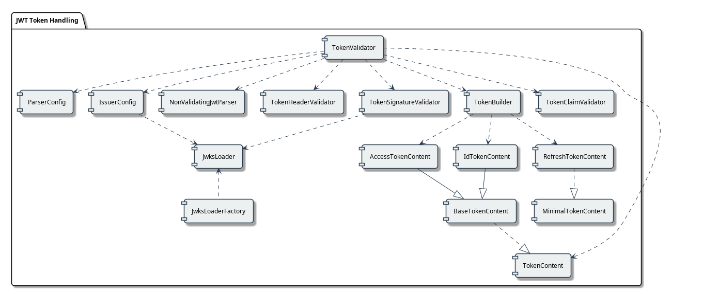

= JWT Token Handling Library Specification
:toc:
:toclevels: 3
:toc-title: Table of Contents
:sectnums:

== Overview
_See Requirement link:Requirements.adoc#CUI-JWT-1[CUI-JWT-1: Token Parsing and Validation]_

This document provides the technical specification for the JWT Token Validation library. The specification details the implementation approach, architecture, and technical decisions to meet the requirements defined in the Requirements.adoc document.

=== Document Navigation

* link:../README.adoc[README] - Project overview and introduction
* link:Usage.adoc[Usage Guide] - How to use the library with code examples
* link:Requirements.adoc[Requirements] - Functional and non-functional requirements
* link:LogMessages.adoc[Log Messages] - Reference for all log messages
* link:security/Threat-Model.adoc[Threat Model] - Security analysis and mitigations
* link:security/jwt-attacks-analysis.adoc[JWT Vulnerabilities and Attacks Analysis] - Analysis of common JWT vulnerabilities
* link:TODO.adoc[TODO] - List of planned enhancements and tasks
* link:Build.adoc[Building and Development] - Information for contributors

== Document Structure

This specification is organized into the following documents:

* link:specification/technical-components.adoc[Technical Components] - Core implementation details for token parsing, validation, and management
* link:specification/well-known.adoc[OIDC Discovery Support] - How the library supports OpenID Connect Discovery for fetching provider metadata.
* link:security/security-specifications.adoc[Security] - Security measures and implementation details
* link:specification/token-decryption.adoc[Token Decryption] - Specifications for token decryption support (JWE)
* link:specification/testing.adoc[Testing] - Unit, integration, and security testing approach
* link:specification/token-size-validation.adoc[Token Size Validation] - Specifications for token size validation
* link:specification/jwks-size-recommendations.adoc[JWKS Size Recommendations] - JWKS size limits and recommendations
* link:specification/benchmark.adoc[Performance Benchmarks] - Performance requirements, methodology, and verification

== Architecture

=== Component Overview
_See Requirement link:Requirements.adoc#CUI-JWT-1[CUI-JWT-1: Token Parsing and Validation]_

The JWT Token Validation library consists of the following main components:

=== Component Descriptions

The following components form the core of the JWT Token Validation library. For detailed information about each component, including implementation status, class hierarchies, and test coverage, please refer to the link:specification/technical-components.adoc[Technical Components] document.

==== TokenValidator
_See Requirement link:Requirements.adoc#CUI-JWT-2[CUI-JWT-2: Token Representation]_

The primary entry point for applications using the library. It provides methods for creating and validating different types of tokens using a pipeline approach.

==== ParserConfig
_See Requirement link:Requirements.adoc#CUI-JWT-6[CUI-JWT-6: Configuration]_

Configuration class for the TokenValidator that allows customizing token size limits and other settings.

==== IssuerConfig
_See Requirement link:Requirements.adoc#CUI-JWT-3[CUI-JWT-3: Multi-Issuer Support]_

Configuration class for issuers that contains all the information needed to validate tokens from a specific issuer, including issuer URL, expected audience, expected client ID, and JWKS key loader.

==== Token Validation Pipeline
_See Requirement link:Requirements.adoc#CUI-JWT-1.3[CUI-JWT-1.3: Signature Validation]_

The token validation pipeline consists of the following components:

* **TokenHeaderValidator**: Validates token headers (algorithm, issuer)
* **TokenSignatureValidator**: Validates token signatures using JWKS
* **TokenBuilder**: Creates token content objects
* **TokenClaimValidator**: Validates token claims (expiration, audience, etc.)

==== NonValidatingJwtParser
_See Requirement link:Requirements.adoc#CUI-JWT-5[CUI-JWT-5: Token Parsing]_

A utility class for inspecting JWT token content without signature validation, used for preliminary token analysis and issuer detection.

==== JwksLoader
_See Requirement link:Requirements.adoc#CUI-JWT-4[CUI-JWT-4: Key Management]_

Handles the retrieval, caching, and rotation of cryptographic keys used for token validation.

==== JwksLoaderFactory
_See Requirement CUI-JWT-4.1: JWKS Endpoint Support in link:Requirements.adoc[Requirements]_

Responsible for creating instances of `JwksLoader` that fetch and parse JSON Web Key Sets (JWKS) from remote endpoints.

==== OIDC Discovery Support Components
_See link:specification/well-known.adoc[OIDC Discovery Support Specification]_

Components that facilitate the discovery of OpenID Provider (OP) configuration metadata, including the JWKS URI.

*   `WellKnownHandler`: Fetches and parses the OIDC discovery document from a provider's `/.well-known/openid-configuration` endpoint. It validates the issuer and provides access to discovered metadata like the `jwks_uri` and `issuer` URL.
*   `WellKnownDispatcher` (Test Utility): A test utility using WireMock to simulate an OIDC provider's discovery endpoint, allowing for isolated testing of `WellKnownHandler` and dependent components.

==== Token Content Classes
_See Requirement CUI-JWT-1.2: Token Types in link:Requirements.adoc[Requirements]_

The library provides the following token content classes:

* **TokenContent**: Interface defining common token functionality
* **BaseTokenContent**: Abstract base class implementing common token functionality
* **MinimalTokenContent**: Interface for tokens without claims
* **AccessTokenContent**: Class for OAuth2 access tokens
* **IdTokenContent**: Class for OpenID Connect ID tokens
* **RefreshTokenContent**: Class for OAuth2 refresh tokens

== Implementation Details

For detailed information about the implementation of the JWT Token Validation library, please refer to the following documents:

* link:specification/technical-components.adoc[Technical Components] - Details about the implementation of core components
* link:security/security-specifications.adoc[Security] - Details about security measures and implementation
* link:specification/token-size-validation.adoc[Token Size Validation] - Details about token size validation implementation
* link:specification/token-decryption.adoc[Token Decryption] - Details about token decryption support (future implementation)

== Testing Strategy
_See Requirement link:Requirements.adoc#CUI-JWT-12[CUI-JWT-12: Testing and Quality Assurance]_

The testing strategy for the JWT Token Validation library includes unit testing, integration testing, security testing, and performance testing. For detailed information about the testing approach, please refer to the link:specification/testing.adoc[Testing] document.

== Appendix

=== Referenced Standards

For a complete list of standards and specifications referenced in this project, see the "Referenced Standards" section in the link:Requirements.adoc[Requirements document].
