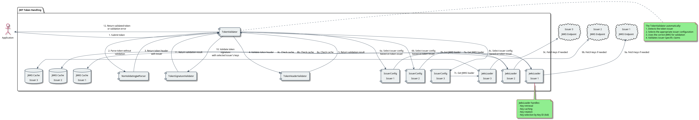
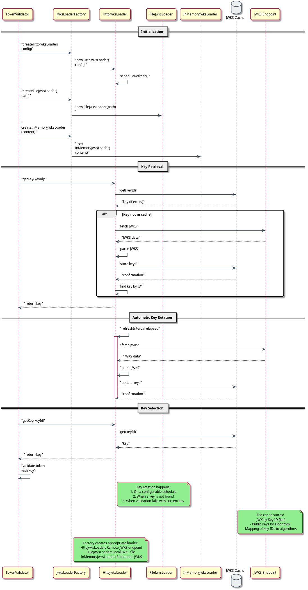
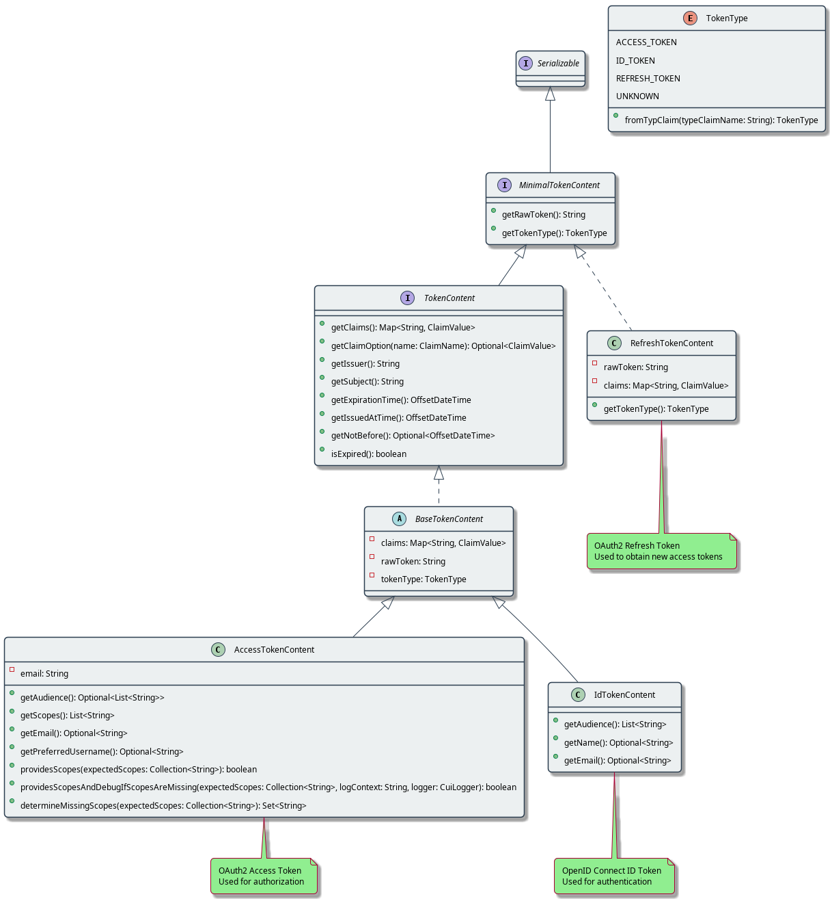

= JWT Token Handling Technical Components
:toc:
:toclevels: 3
:toc-title: Table of Contents
:sectnums:

link:../Specification.adoc[Back to Main Specification]

== Overview
_See Requirement link:../Requirements.adoc#CUI-JWT-1[CUI-JWT-1: Token Parsing and Validation]_

This document provides detailed specifications for the technical components of the JWT token handling library.

== Component Specifications

=== TokenValidator
_See Requirement link:../Requirements.adoc#CUI-JWT-2[CUI-JWT-2: Token Representation]_

==== Status: IMPLEMENTED

This specification has been implemented in the following classes:

* link:../../src/main/java/de/cuioss/jwt/validation/TokenValidator.java[TokenValidator] (class)
* link:../../src/main/java/de/cuioss/jwt/validation/TokenParserConfig.java[TokenParserConfig] (configuration)

The `TokenValidator` is the primary entry point for applications using the library. It provides methods for creating and validating different types of tokens (access, ID, refresh) while handling the complexity of token parsing and validation through a pipeline approach.

The `TokenValidator` uses a pipeline of validators and builders to process tokens:

1. `TokenHeaderValidator` - Validates token headers (algorithm, issuer)
2. `TokenSignatureValidator` - Validates token signatures using JWKS
3. `TokenBuilder` - Creates token content objects
4. `TokenClaimValidator` - Validates token claims (expiration, audience, etc.)

For implementation details, see the JavaDoc of the link:../../src/main/java/de/cuioss/jwt/validation/TokenValidator.java[TokenValidator] class.

The following tests verify the implementation:

* link:../../src/test/java/de/cuioss/jwt/validation/TokenValidatorTest.java[TokenValidatorTest]

=== Token Validation Pipeline
_See Requirement link:../Requirements.adoc#CUI-JWT-1.3[CUI-JWT-1.3: Signature Validation]_

==== Status: IMPLEMENTED

This specification has been implemented in the following classes:

* link:../../src/main/java/de/cuioss/jwt/validation/flow/TokenHeaderValidator.java[TokenHeaderValidator] (class)
* link:../../src/main/java/de/cuioss/jwt/validation/flow/TokenSignatureValidator.java[TokenSignatureValidator] (class)
* link:../../src/main/java/de/cuioss/jwt/validation/flow/TokenBuilder.java[TokenBuilder] (class)
* link:../../src/main/java/de/cuioss/jwt/validation/flow/TokenClaimValidator.java[TokenClaimValidator] (class)
* link:../../src/main/java/de/cuioss/jwt/validation/flow/NonValidatingJwtParser.java[NonValidatingJwtParser] (class)

The token validation pipeline replaces the previous JwtParser interface with a more modular approach. Each component in the pipeline has a specific responsibility:

* `TokenHeaderValidator` - Validates token headers (algorithm, issuer)
* `TokenSignatureValidator` - Validates token signatures using JWKS
* `TokenBuilder` - Creates token content objects
* `TokenClaimValidator` - Validates token claims (expiration, audience, etc.)
* `NonValidatingJwtParser` - Provides initial token decoding without validation

This pipeline approach provides several benefits:

* Better separation of concerns
* More flexible validation process
* Improved error handling and reporting
* Enhanced security through comprehensive validation

For implementation details, see the JavaDoc of the pipeline component classes.

The following tests verify the implementation:

* link:../../src/test/java/de/cuioss/jwt/validation/flow/TokenHeaderValidatorTest.java[TokenHeaderValidatorTest]
* link:../../src/test/java/de/cuioss/jwt/validation/flow/TokenSignatureValidatorTest.java[TokenSignatureValidatorTest]
* link:../../src/test/java/de/cuioss/jwt/validation/flow/TokenBuilderTest.java[TokenBuilderTest]
* link:../../src/test/java/de/cuioss/jwt/validation/flow/TokenClaimValidatorTest.java[TokenClaimValidatorTest]
* link:../../src/test/java/de/cuioss/jwt/validation/flow/NonValidatingJwtParserTest.java[NonValidatingJwtParserTest]

=== IssuerConfig and Multi-Issuer Support
_See Requirement link:../Requirements.adoc#CUI-JWT-3[CUI-JWT-3: Multi-Issuer Support]_

==== Status: IMPLEMENTED

This specification has been implemented in the following classes:

* link:../../src/main/java/de/cuioss/jwt/validation/IssuerConfig.java[IssuerConfig] (class)

The `IssuerConfig` class replaces the previous MultiIssuerJwtParser approach with a more flexible configuration-based approach. Each IssuerConfig instance contains all the information needed to validate tokens from a specific issuer:

* Issuer URL
* Expected audience values
* Expected client ID values
* JWKS configuration (one of the following):
  * HTTP JWKS configuration (httpJwksLoaderConfig)
  * File path to JWKS file (jwksFilePath)
  * In-memory JWKS content (jwksContent)
* Algorithm preferences
* Custom claim mappers

The IssuerConfig uses a lazy initialization approach for the JwksLoader. Instead of requiring a pre-initialized JwksLoader, it accepts configuration parameters and initializes the appropriate JwksLoader when needed. This initialization happens through the `initSecurityEventCounter` method, which is called by TokenValidator and passes the SecurityEventCounter to the JwksLoader.

This approach provides several benefits:

* Simplified configuration - no need to create JwksLoader instances separately
* Consistent SecurityEventCounter usage across all components
* Centralized management of JwksLoader initialization
* Support for multiple JWKS source types (HTTP, file, in-memory)

The TokenValidator manages multiple IssuerConfig instances, inspects JWT tokens, determines their issuer, and selects the appropriate configuration for validation.

==== Multi-Issuer Architecture

The module provides robust support for multi-issuer environments through:

* Configuration of multiple issuers with IssuerConfig objects
* Automatic issuer detection and validation
* Thread-safe token validation

==== Key Management

The key management system handles the retrieval, caching, and rotation of cryptographic keys used for token validation.

For implementation details, see the JavaDoc of the link:../../src/main/java/de/cuioss/jwt/validation/IssuerConfig.java[IssuerConfig] class.

The following tests verify the implementation:

* link:../../src/test/java/de/cuioss/jwt/validation/IssuerConfigTest.java[IssuerConfigTest]
* link:../../src/test/java/de/cuioss/jwt/validation/TokenValidatorTest.java[TokenValidatorTest]

=== JwksLoader
_See Requirement link:../Requirements.adoc#CUI-JWT-4[CUI-JWT-4: Key Management]_

==== Status: IMPLEMENTED

This specification has been implemented in the following classes:

* link:../../src/main/java/de/cuioss/jwt/validation/jwks/JwksLoader.java[JwksLoader] (interface)
* link:../../src/main/java/de/cuioss/jwt/validation/jwks/http/HttpJwksLoader.java[HttpJwksLoader] (implementation)
* link:../../src/main/java/de/cuioss/jwt/validation/jwks/key/JWKSKeyLoader.java[JWKSKeyLoader] (implementation)
* link:../../src/main/java/de/cuioss/jwt/validation/jwks/JwksLoaderFactory.java[JwksLoaderFactory] (factory)

The `JwksLoader` interface handles the retrieval, caching, and rotation of cryptographic keys used for token validation. The `JWKSKeyLoader` class is used by the TokenSignatureValidator to validate token signatures. All implementations integrate with the SecurityEventCounter to track security events related to key management.

The JwksLoaderFactory provides methods to create different types of JwksLoader implementations:

* `createHttpLoader` - Creates an HTTP-based loader that fetches keys from a remote endpoint
* `createFileLoader` - Creates a file-based loader that reads keys from a local file
* `createInMemoryLoader` - Creates an in-memory loader that uses a provided JWKS string

Each method requires a SecurityEventCounter parameter to track security events.

For implementation details, see the JavaDoc of the following classes:

* link:../../src/main/java/de/cuioss/jwt/validation/jwks/JwksLoader.java[JwksLoader]
* link:../../src/main/java/de/cuioss/jwt/validation/jwks/http/HttpJwksLoader.java[HttpJwksLoader]
* link:../../src/main/java/de/cuioss/jwt/validation/jwks/key/JWKSKeyLoader.java[JWKSKeyLoader]
* link:../../src/main/java/de/cuioss/jwt/validation/jwks/JwksLoaderFactory.java[JwksLoaderFactory]

The following tests verify the implementation:

* link:../../src/test/java/de/cuioss/jwt/validation/jwks/http/HttpJwksLoaderTest.java[HttpJwksLoaderTest]
* link:../../src/test/java/de/cuioss/jwt/validation/jwks/http/HttpJwksLoaderCachingAndFallbackTest.java[HttpJwksLoaderCachingAndFallbackTest]
* link:../../src/test/java/de/cuioss/jwt/validation/jwks/FileJwksLoaderTest.java[FileJwksLoaderTest]
* link:../../src/test/java/de/cuioss/jwt/validation/jwks/InMemoryJwksLoaderTest.java[InMemoryJwksLoaderTest]
* link:../../src/test/java/de/cuioss/jwt/validation/jwks/key/JWKSKeyLoaderTest.java[JWKSKeyLoaderTest]

=== SecurityEventCounter
_See Requirement link:../Requirements.adoc#CUI-JWT-7.3[CUI-JWT-7.3: Security Events]_

==== Status: IMPLEMENTED

This specification has been implemented in the following classes:

* link:../../src/main/java/de/cuioss/jwt/validation/security/SecurityEventCounter.java[SecurityEventCounter] (class)
* link:../../src/main/java/de/cuioss/jwt/validation/TokenValidator.java[TokenValidator] (integration)
* link:../../src/main/java/de/cuioss/jwt/validation/IssuerConfig.java[IssuerConfig] (integration)
* link:../../src/main/java/de/cuioss/jwt/validation/jwks/JwksLoaderFactory.java[JwksLoaderFactory] (integration)

The `SecurityEventCounter` provides a thread-safe mechanism for counting security events that occur during token processing. It is created by the TokenValidator and passed to all components in the token validation pipeline, including:

* TokenHeaderValidator
* TokenSignatureValidator
* TokenClaimValidator
* JwksLoader implementations

The counter follows the same naming/numbering scheme as JWTTokenLogMessages for consistency and easier correlation between logs and metrics. It is designed to be highly concurrent and provides methods for:

* Incrementing event counters
* Getting counts for specific event types
* Getting a snapshot of all counters
* Resetting individual or all counters

The implementation is structured to simplify later integration with metrics systems like Micrometer but does not create any dependency on it.

For implementation details, see the JavaDoc of the link:../../src/main/java/de/cuioss/jwt/validation/security/SecurityEventCounter.java[SecurityEventCounter] class.

The following tests verify the implementation:

* link:../../src/test/java/de/cuioss/jwt/validation/security/SecurityEventCounterTest.java[SecurityEventCounterTest]
* link:../../src/test/java/de/cuioss/jwt/validation/TokenValidatorSecurityEventTest.java[TokenValidatorSecurityEventTest]

=== Token Architecture and Types
_See Requirement link:../Requirements.adoc#CUI-JWT-1.2[CUI-JWT-1.2: Token Types]_

==== Status: IMPLEMENTED

This specification has been implemented in the following classes:

* link:../../src/main/java/de/cuioss/jwt/validation/domain/token/TokenContent.java[TokenContent] (interface)
* link:../../src/main/java/de/cuioss/jwt/validation/domain/token/BaseTokenContent.java[BaseTokenContent] (abstract class)
* link:../../src/main/java/de/cuioss/jwt/validation/domain/token/MinimalTokenContent.java[MinimalTokenContent] (interface)
* link:../../src/main/java/de/cuioss/jwt/validation/domain/token/AccessTokenContent.java[AccessTokenContent] (class)
* link:../../src/main/java/de/cuioss/jwt/validation/domain/token/IdTokenContent.java[IdTokenContent] (class)
* link:../../src/main/java/de/cuioss/jwt/validation/domain/token/RefreshTokenContent.java[RefreshTokenContent] (class)

==== Architecture

The module uses a flexible architecture based on inheritance and composition:

* `TokenContent`: Core interface defining JWT token functionality
* `BaseTokenContent`: Abstract base class implementing common token functionality
* `MinimalTokenContent`: Minimal interface for tokens without claims

==== Token Types

The module supports three token types, each with specific functionality:

* `AccessTokenContent`: OAuth2 access token with scope and role support
** Extends BaseTokenContent for common token functionality
** Provides enhanced scope and role management
** Supports email and preferred username claims
* `IdTokenContent`: OpenID Connect ID token for user identity
** Extends BaseTokenContent for common token functionality
** Focuses on identity information claims
** Provides access to name and email claims
* `RefreshTokenContent`: OAuth2 refresh token
** Implements MinimalTokenContent interface
** Treats refresh tokens as opaque strings per OAuth2 specification

The library provides specialized classes for different token types, each with functionality appropriate for its use case.

`AccessTokenContent` and `IdTokenContent` extend the `BaseTokenContent` abstract class, which implements the `TokenContent` interface. This provides a common base for token functionality while allowing for type-specific extensions.

`RefreshTokenContent` implements the `MinimalTokenContent` interface and provides functionality for handling refresh tokens, which are treated primarily as opaque strings according to OAuth2 specifications.

For implementation details, see the JavaDoc of the following classes:

* link:../../src/main/java/de/cuioss/jwt/validation/domain/token/TokenContent.java[TokenContent]
* link:../../src/main/java/de/cuioss/jwt/validation/domain/token/BaseTokenContent.java[BaseTokenContent]
* link:../../src/main/java/de/cuioss/jwt/validation/domain/token/MinimalTokenContent.java[MinimalTokenContent]
* link:../../src/main/java/de/cuioss/jwt/validation/domain/token/AccessTokenContent.java[AccessTokenContent]
* link:../../src/main/java/de/cuioss/jwt/validation/domain/token/IdTokenContent.java[IdTokenContent]
* link:../../src/main/java/de/cuioss/jwt/validation/domain/token/RefreshTokenContent.java[RefreshTokenContent]

The following tests verify the implementation:

* link:../../src/test/java/de/cuioss/jwt/validation/domain/token/AccessTokenContentTest.java[AccessTokenContentTest]
* link:../../src/test/java/de/cuioss/jwt/validation/domain/token/IdTokenContentTest.java[IdTokenContentTest]
* link:../../src/test/java/de/cuioss/jwt/validation/domain/token/RefreshTokenContentTest.java[RefreshTokenContentTest]

=== Dependency Management
_See Requirement link:../Requirements.adoc#CUI-JWT-8[CUI-JWT-8: Security]_

==== Status: IMPLEMENTED

The library implements automated dependency management to ensure that dependencies are kept up-to-date with the latest security patches and bug fixes. This is implemented using GitHub Dependabot, which is configured to scan Maven dependencies weekly and create pull requests for updates.

The Dependabot configuration can be found in `.github/dependabot.yml` and includes:

* Weekly scanning of Maven dependencies
* Automatic creation of pull requests for dependency updates
* Prioritization of security updates

This implementation ensures that the library's dependencies are regularly updated to their latest stable versions, reducing security vulnerabilities and ensuring access to the latest features.
