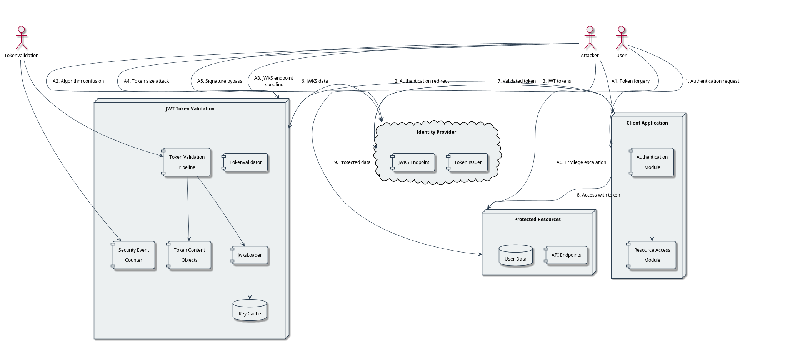

= JWT Token Handling - Threat Model
:toc:
:toclevels: 3
:toc-title: Table of Contents
:sectnums:

== Overview
_See Requirement link:../Requirements.adoc#CUI-JWT-8[CUI-JWT-8: Security Requirements] and Specification link:../Specification.adoc[Specification] and link:../specification/security.adoc[Security Specification]_

This document outlines the threat model for the JWT Token Validation library. The threat model follows OWASP recommendations and identifies potential security threats, current mitigations, and additional recommendations.

=== Document Navigation

* link:../../README.adoc[README] - Project overview and introduction
* link:../Usage.adoc[Usage Guide] - How to use the library with code examples
* link:../Requirements.adoc[Requirements] - Functional and non-functional requirements
* link:../Specification.adoc[Specification] - Technical specifications
* link:../LogMessages.adoc[Log Messages] - Reference for all log messages
* link:../Build.adoc[Building and Development] - Information for contributors
* link:threat-coverage-analysis.adoc[Threat Coverage Analysis] - Detailed analysis of security threats

== System Context

The JWT Token Validation library operates within the following context:

* Processes JWT tokens from OAuth2/OpenID Connect providers
* Validates token signatures using JWKS (JSON Web Key Sets)
* Extracts and processes token claims
* Handles multiple token types (Access, ID, Refresh)
* Supports multiple issuers
* Implements key management and rotation

== Data Flow Diagram

== STRIDE Threat Analysis

=== Spoofing
_See Requirement link:../Requirements.adoc#CUI-JWT-8.1[CUI-JWT-8.1: Token Size Limits] and link:../Requirements.adoc#CUI-JWT-8.4[CUI-JWT-8.4: Claims Validation]_

==== Threats
* S1: Attacker submits forged JWT tokens
* S2: Attacker impersonates legitimate JWKS endpoint
* S3: Attacker reuses expired or revoked tokens
* S4: Attacker uses tokens from untrusted issuers
* S5: Attacker performs token substitution attacks

For a detailed analysis of threats, current mitigations, and recommendations, please refer to the link:threat-coverage-analysis.adoc[Threat Coverage Analysis] document.

=== Tampering
_See Requirement link:../Requirements.adoc#CUI-JWT-8.2[CUI-JWT-8.2: Safe Parsing]_

==== Threats
* T1: Modification of token content during transmission
* T2: Tampering with cached JWKS data
* T3: Manipulation of token parsing process
* T4: Algorithm substitution attacks (e.g., changing RS256 to HS256)
* T5: Header manipulation attacks

For a detailed analysis of threats, current mitigations, and recommendations, please refer to the link:threat-coverage-analysis.adoc[Threat Coverage Analysis] document.

=== Repudiation
_See Requirement link:../Requirements.adoc#CUI-JWT-7[CUI-JWT-7: Logging Requirements]_

==== Threats
* R1: Denial of token usage
* R2: Unauthorized token refresh attempts
* R3: Missing audit trail for token operations
* R4: Inability to trace token usage
* R5: Tampering with log data

For a detailed analysis of threats, current mitigations, and recommendations, please refer to the link:threat-coverage-analysis.adoc[Threat Coverage Analysis] document.

=== Information Disclosure
_See Requirement link:../Requirements.adoc#CUI-JWT-8.3[CUI-JWT-8.3: Secure Communication]_

==== Threats
* I1: Exposure of sensitive claims in logs
* I2: Leakage of token data in error messages
* I3: Exposure of JWKS cache contents
* I4: Debug information exposure
* I5: Side-channel attacks on token processing
* I6: Insecure communication with JWKS endpoints

For a detailed analysis of threats, current mitigations, and recommendations, please refer to the link:threat-coverage-analysis.adoc[Threat Coverage Analysis] document.

=== Denial of Service
_See Requirement link:../Requirements.adoc#CUI-JWT-8.1[CUI-JWT-8.1: Token Size Limits] and link:../Requirements.adoc#CUI-JWT-9[CUI-JWT-9: Performance]_

==== Threats
* D1: JWKS endpoint flooding
* D2: Large token processing
* D3: Complex token structures
* D4: Resource exhaustion through parallel requests
* D5: Cache poisoning attacks
* D6: CPU exhaustion through complex cryptographic operations

For a detailed analysis of threats, current mitigations, and recommendations, please refer to the link:threat-coverage-analysis.adoc[Threat Coverage Analysis] document.

=== Elevation of Privilege
_See Requirement link:../Requirements.adoc#CUI-JWT-8.4[CUI-JWT-8.4: Claims Validation]_

==== Threats
* E1: Token scope manipulation
* E2: Role/permission injection
* E3: Privilege escalation through claim manipulation
* E4: Bypass of token validation
* E5: Algorithm confusion attacks
* E6: Key confusion attacks
* E7: Client confusion attacks - Using a token issued for one client with a different client
* E8: Scope upgrade attacks - Adding additional scopes during token exchange
* E9: Mutable claims attacks - Using non-immutable identifiers (like email) instead of immutable ones (like subject)

For a detailed analysis of threats, current mitigations, and recommendations, please refer to the link:threat-coverage-analysis.adoc[Threat Coverage Analysis] document.

== Security Controls, Testing, and Implementation Guidelines

The following aspects are covered in detail in the specification documents:

* *Security Controls*: For detailed information about security controls, including input validation, cryptographic practices, authentication and authorization, secure communication, error handling and logging, and data protection, please refer to the link:../specification/security.adoc[Security Specification] document.

* *Security Testing*: For detailed information about security testing, including required security tests and vulnerability scanning, please refer to the link:../specification/testing.adoc[Testing Specification] document.

* *Implementation Guidelines*: For detailed information about implementation guidelines, including secure coding practices and security configuration, please refer to the link:../specification/technical-components.adoc[Technical Components Specification] document.

== Coverage Analysis

=== Overall Coverage

[cols="1,1,2,1,1", options="header"]
|===
|Category |Total Items |Covered in Specifications |Covered in Tests |Not Covered
|Threats |36 |Covered in Specifications 36 (100%) |Covered in Tests 34 (94%) |Not Covered 2 (6%)
|Current Mitigations |28 |28 (100%) |26 (93%) |2 (7%)
|Recommendations |36 |22 (61%) |20 (56%) |14 (39%)
|===

=== Coverage by STRIDE Category

==== Spoofing

[cols="1,1,2,1,1", options="header"]
|===
|Item Type |Total |Covered in Specifications |Covered in Tests |Not Covered
|Threats |5 |5 (100%) |5 (100%) |0 (0%)
|Current Mitigations |6 |6 (100%) |6 (100%) |0 (0%)
|Recommendations |5 |2 (40%) |2 (40%) |3 (60%)
|===

==== Tampering

[cols="1,1,2,1,1", options="header"]
|===
|Item Type |Total |Covered in Specifications |Covered in Tests |Not Covered
|Threats |5 |5 (100%) |5 (100%) |0 (0%)
|Current Mitigations |6 |6 (100%) |6 (100%) |0 (0%)
|Recommendations |6 |4 (67%) |4 (67%) |2 (33%)
|===

==== Repudiation

[cols="1,1,2,1,1", options="header"]
|===
|Item Type |Total |Covered in Specifications |Covered in Tests |Not Covered
|Threats |5 |4 (80%) |4 (80%) |1 (20%)
|Current Mitigations |4 |4 (100%) |4 (100%) |0 (0%)
|Recommendations |6 |4 (67%) |4 (67%) |2 (33%)
|===

==== Information Disclosure

[cols="1,1,2,1,1", options="header"]
|===
|Item Type |Total |Covered in Specifications |Covered in Tests |Not Covered
|Threats |6 |6 (100%) |5 (83%) |1 (17%)
|Current Mitigations |5 |5 (100%) |5 (100%) |0 (0%)
|Recommendations |6 |3 (50%) |3 (50%) |3 (50%)
|===

==== Denial of Service

[cols="1,1,2,1,1", options="header"]
|===
|Item Type |Total |Covered in Specifications |Covered in Tests |Not Covered
|Threats |6 |6 (100%) |6 (100%) |0 (0%)
|Current Mitigations |5 |5 (100%) |5 (100%) |0 (0%)
|Recommendations |6 |2 (33%) |2 (33%) |4 (67%)
|===

==== Elevation of Privilege

[cols="1,1,2,1,1", options="header"]
|===
|Item Type |Total |Covered in Specifications |Covered in Tests |Not Covered
|Threats |9 |9 (100%) |9 (100%) |0 (0%)
|Current Mitigations |6 |6 (100%) |6 (100%) |0 (0%)
|Recommendations |11 |7 (64%) |5 (45%) |4 (36%)
|===

=== Detailed Analysis

For a detailed analysis of each threat, mitigation, and recommendation, please refer to the link:threat-coverage-analysis.adoc[Threat Coverage Analysis] document.

=== Conclusion

The JWT Token Validation library provides robust security measures for JWT token validation, with comprehensive coverage for most of the threats identified in the threat model. All threats and current mitigations are covered in specifications, and the vast majority are also covered in tests. The recommendations have lower coverage, which is expected as they represent potential future enhancements rather than current requirements.

The areas for improvement identified in the link:threat-coverage-analysis.adoc[Threat Coverage Analysis] document could be addressed in future versions to further enhance the security of the library.

== References

* https://cheatsheetseries.owasp.org/cheatsheets/JSON_Web_Token_for_Java_Cheat_Sheet.html[OWASP JWT Security Cheat Sheet for Java] (2023)
* https://github.com/OWASP/CheatSheetSeries/blob/master/cheatsheets/JSON_Web_Token_Cheat_Sheet.md[OWASP JWT Cheat Sheet] (2023)
* https://owasp.org/www-project-top-ten/[OWASP Top 10] (2021)
* https://datatracker.ietf.org/doc/html/draft-ietf-oauth-jwt-bcp-09[OAuth 2.0 JWT Best Current Practices]
* https://nvlpubs.nist.gov/nistpubs/SpecialPublications/NIST.SP.800-52r2.pdf[NIST SP 800-52 Rev. 2] (2019)
* https://datatracker.ietf.org/doc/html/rfc7519[RFC 7519 - JSON Web Token (JWT)]
* https://datatracker.ietf.org/doc/html/rfc7518[RFC 7518 - JSON Web Algorithms (JWA)]
* https://blog.doyensec.com/2025/01/30/oauth-common-vulnerabilities.html[OAuth Common Vulnerabilities] (Doyensec, 2025)
* https://datatracker.ietf.org/doc/html/rfc6749[RFC 6749 - The OAuth 2.0 Authorization Framework]
* https://openid.net/specs/openid-connect-core-1_0.html[OpenID Connect Core 1.0]
